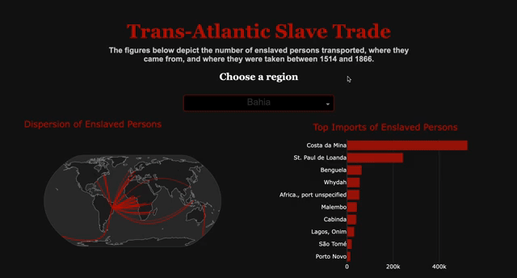

# Trans-Atlantic Slave Trade Visualization Dashboard
  

  

  

## Overview
This project is an interactive data visualization dashboard that explores the transatlantic slave trade, focusing on the number of enslaved persons transported, their origins, and their destinations between 1514 and 1866. Leveraging advanced data processing techniques and interactive visualizations, this project transforms historical data into an accessible and insightful narrative.

## Significance

The transatlantic slave trade represents one of the most significant periods in human history. This project aims to present the data in a way that not only highlights the sheer scale of this human tragedy but also provides a deeper understanding of the patterns and impact of this global trade. By applying data science and visualization skills, this dashboard makes it possible to analyze historical trends, recognize regional variations, and engage with historical data dynamically.

### Features

  - Advanced Data Processing & Cleaning:

    - Utilizes Pandas for efficient data wrangling, filtering, and transformation.

    - Handles missing values and inconsistencies to ensure accurate analysis.

  - Dynamic Data Visualization:

    - Interactive bar charts showing the number of enslaved individuals transported per year.

    - A geographic scatter plot visualizing the dispersion of enslaved persons.

    - A ranked horizontal bar chart displaying the top import regions.

  - User Interaction:

    - A dropdown menu allows users to select a specific destination region, updating the visualizations dynamically.

    - Hover interactions provide additional insights into data points.

  - Sleek & Modern UI:

    - Classic dark theme with elegant typography and well-balanced colors.

    - Responsive layout ensuring usability across various devices.

### Technologies Used

Python (Dash, Flask, Pandas, Plotly, NumPy)

Frontend (HTML, CSS, JavaScript via Dash components)

Data Processing (Pandas for data cleaning and manipulation)

### Installation

To run the project locally, follow these steps:

#### 1. Clone the Repository

`git clone https://github.com/yourusername/transatlantic-slave-trade-dashboard.git`
 
`cd transatlantic-slave-trade-dashboard`
 

#### 2. Set Up a Virtual Environment (Optional but Recommended)

`python -m venv venv`
 
`source venv/bin/activate`
 

#### 3. Install Dependencies

`pip install -r requirements.txt`
 

#### 4. Run the Application

`python app.py`
 

Then open your browser and visit: http://127.0.0.1:8080/

### Data Source:

The dataset used in this project originates from SlaveVoyages.org and contains records of more than 36,000 voyages that transported enslaved Africans to the Americas between the 16th and 19th centuries. The dataset can be found here: https://www.slavevoyages.org/documents/download/tastdb-exp-2020.sav

##### Key Features:

  - Voyage Data: Details about individual slave ship voyages, including departure and arrival locations, number of enslaved people transported, and ship names.

  - People Data: Information on specific enslaved individuals, including names, ages, and places of origin when available.

  - Estimates & Statistics: Analysis of the total number of enslaved people transported, mortality rates, and other trade-related statistics.
